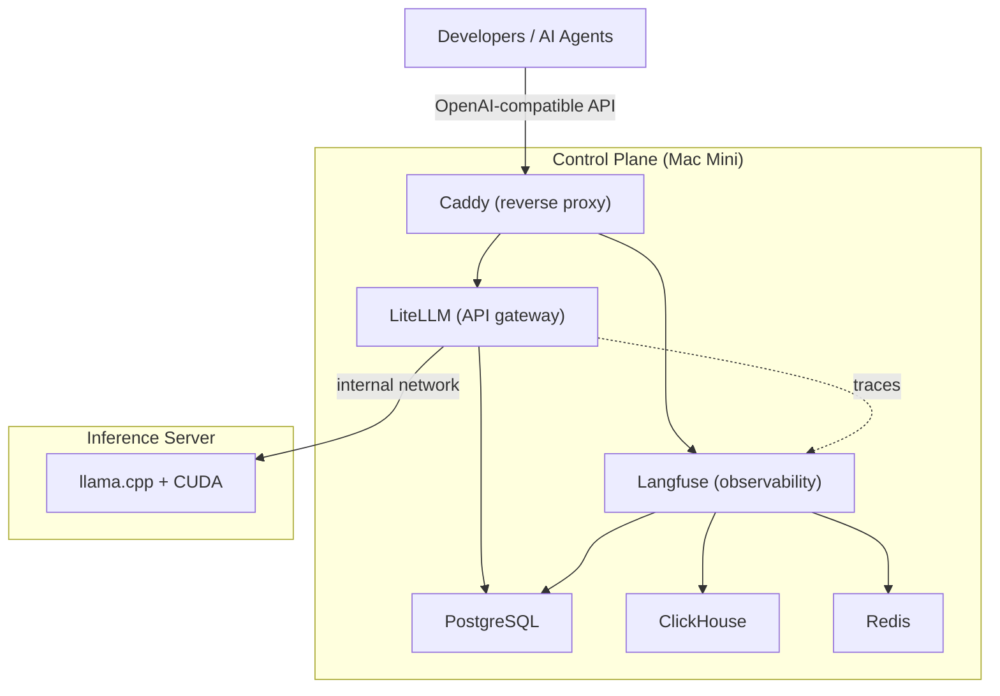
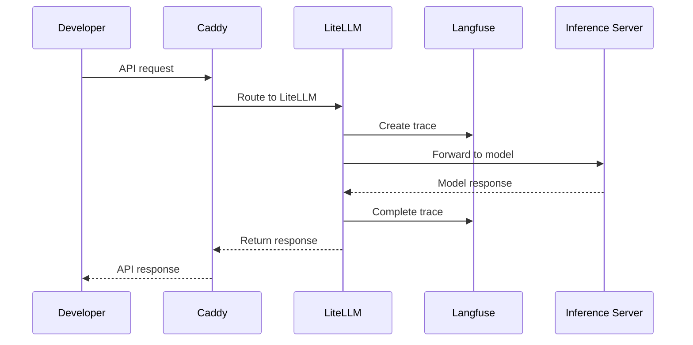
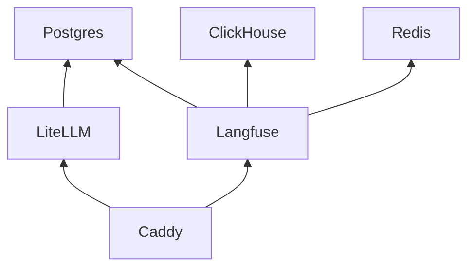
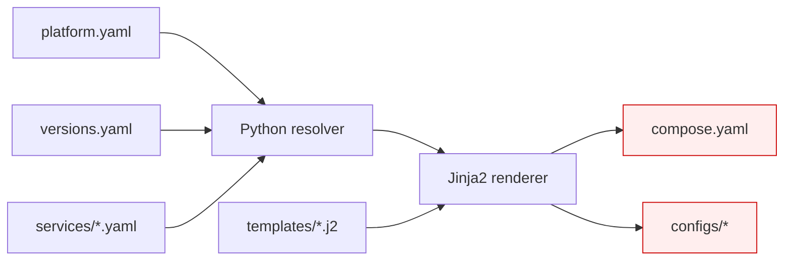

# Architecture

This document describes the technical architecture of the AI Platform.

For design rationale, see [DECISIONS.md](DECISIONS.md).

## System Overview

The platform runs on two machines. The control plane hosts routing, observability, and storage as containers. The inference server runs models.

## Service Responsibilities

| Service | Role | Port |
|---|---|---|
| Caddy | Reverse proxy, TLS termination | 80, 443 |
| LiteLLM | OpenAI-compatible API gateway, model routing | 4000 |
| Langfuse | Trace logging, cost tracking, latency monitoring | 3000 |
| PostgreSQL | Persistent relational storage (LiteLLM, Langfuse) | 5432 |
| ClickHouse | Analytics and event storage (Langfuse) | 8123 |
| Redis | Caching and background jobs (Langfuse) | 6379 |

Clients never access databases or inference servers directly. All traffic enters through Caddy.

## Request Flow

## Service Dependencies

The platform starts services in topological order. A service starts only after its dependencies are healthy.

## Configuration Pipeline

Source files produce generated files. Never edit generated files directly.

| Layer | Files | Editable |
|---|---|---|
| Configuration | `platform.yaml`, `versions.yaml` | Yes |
| Service manifests | `services/*.yaml` | Yes |
| Templates | `templates/**/*.j2` | Yes |
| Python logic | `platform/` | Yes |
| Generated output | `compose.yaml`, `configs/` | **No** |

## Network Model

All services share a single bridge network (`ai-platform`).

- Clients connect through Caddy on ports 80/443.
- Inference servers accept requests only from LiteLLM.
- Databases are not exposed outside the container network in production.

## Security Model

- Secrets are stored in `.env`, which is excluded from Git.
- Containers use official upstream images.
- Services follow least-privilege defaults.
- Configuration is validated before deployment.

## Persistent Storage

| Service | Volume | Data |
|---|---|---|
| PostgreSQL | `./data/postgres` | User data, LiteLLM state, Langfuse metadata |
| ClickHouse | `./data/clickhouse` | Traces and analytics events |
| Redis | `./data/redis` | Cache and job queue state |

Containers are disposable. Persistent state lives in volumes under `data/`.

The `data/` directory is excluded from Git.