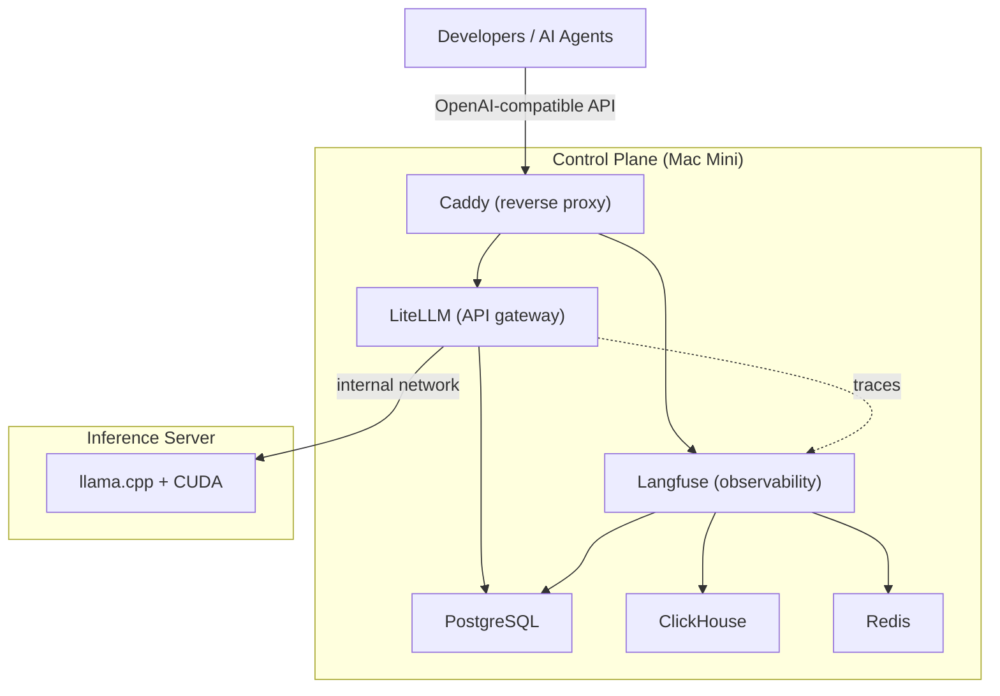
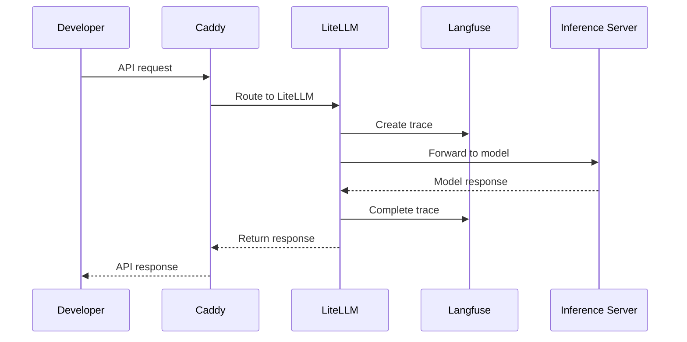
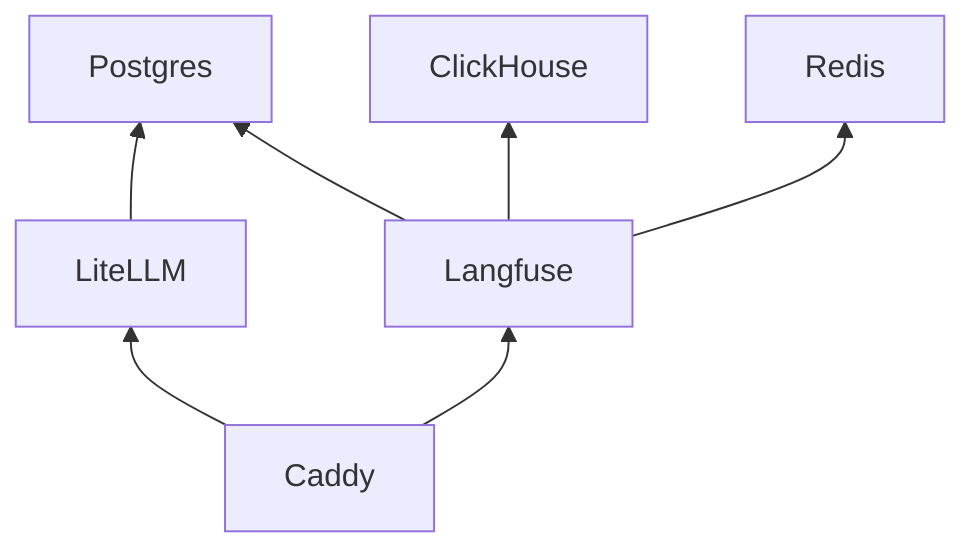
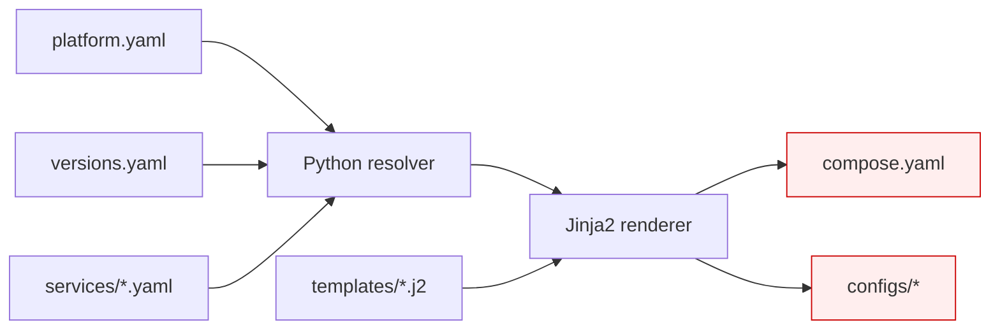
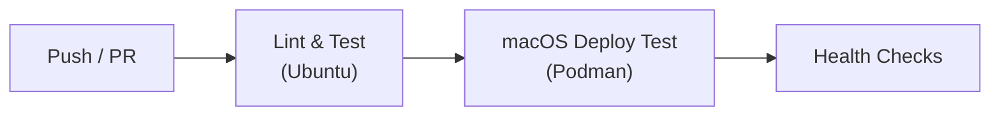

# Architecture

This document describes the technical architecture of the AI Platform.

For design rationale, see [DECISIONS.md](DECISIONS.md).

## System Overview

The platform runs on two machines. The control plane hosts routing, observability, and storage as containers. The inference server runs models.



## Service Responsibilities

| Service | Role | Host Port | Container Port |
|---|---|---|---|
| Caddy | Reverse proxy, TLS termination | 8080, 8443 | 80, 443 |
| LiteLLM | OpenAI-compatible API gateway, model routing | 4000 | 4000 |
| Langfuse | Trace logging, cost tracking, latency monitoring | 3000 | 3000 |
| PostgreSQL | Persistent relational storage (LiteLLM, Langfuse) | 5432 | 5432 |
| ClickHouse | Analytics and event storage (Langfuse) | 8123, 9000 | 8123, 9000 |
| Redis | Caching and background jobs (Langfuse) | 6379 | 6379 |

Clients never access databases or inference servers directly. All traffic enters through Caddy.

> **Note:** Caddy uses unprivileged ports (8080/8443) for rootless Podman operation.

## Request Flow



## Service Dependencies

The platform starts services in topological order. A service starts only after its dependencies are healthy.



## Installation Architecture

The platform uses a two-layer installation model:

```
bootstrap.sh          "Prepare this Mac."
       │
       ├── macOS prerequisites
       ├── Homebrew
       ├── Python
       ├── uv
       ├── Podman + machine init
       ├── Port validation
       ├── Secrets generation
       │
       ▼
bootstrap.py          "Deploy this platform."
       │
       ├── Configuration validation
       ├── Template rendering
       ├── Container deployment
       └── Health verification
```

| Layer | Responsibility | Files |
|---|---|---|
| Machine preparation | Install tools, init Podman, generate secrets | `bootstrap.sh`, `scripts/install/*.sh` |
| Platform deployment | Validate config, render templates, deploy containers | `bootstrap.py`, `platform/*.py` |

## Configuration Pipeline

Source files produce generated files. Never edit generated files directly.



| Layer | Files | Editable |
|---|---|---|
| Configuration | `platform.yaml`, `versions.yaml` | Yes |
| Service manifests | `services/*.yaml` | Yes |
| Templates | `templates/**/*.j2` | Yes |
| Python logic | `platform/` | Yes |
| Shell installer | `bootstrap.sh`, `scripts/install/` | Yes |
| Generated output | `compose.yaml`, `configs/` | **No** |
| Secrets | `.env`, `secrets/` | **No** (generated) |
| Install state | `.install-state` | **No** (generated) |

## Network Model

The architecture uses a two-tier network design:

1. **Control Plane Internal Network (`ai-platform`)**:
   - A bridge network inside the Mac Mini Podman environment connecting Caddy, LiteLLM, Langfuse, Postgres, ClickHouse, and Redis.
   - Databases and internal ports are isolated within the container network.
   - External clients connect exclusively through Caddy on ports 8080/8443.

2. **Dedicated Private Inference Network (`10.42.0.0/24`)**:
   - A dedicated point-to-point Ethernet link directly connecting the Mac Mini (`10.42.0.1/24`) and the Linux Inference PC (`10.42.0.2/24`).
   - LiteLLM forwards requests across this link to `http://10.42.0.2:8080/v1`.
   - **Safety Invariant**: No default gateway, no DNS nameservers, and no NAT are installed on this private interface by default, fully preserving both machines' existing default routes and internet connections.

## Security Model

- Secrets are stored in `.env` and `secrets/`, which are excluded from Git.
- Secrets are generated by `bootstrap.sh` with strong random values.
- Containers use official upstream images with pinned versions.
- Services follow least-privilege defaults.
- Configuration is validated before deployment.
- Caddy uses unprivileged ports (8080/8443) for rootless operation.

## Persistent Storage

| Service | Volume | Data |
|---|---|---|
| PostgreSQL | `./data/postgres` | User data, LiteLLM state, Langfuse metadata |
| ClickHouse | `./data/clickhouse` | Traces and analytics events |
| Redis | `./data/redis` | Cache and job queue state |

Containers are disposable. Persistent state lives in volumes under `data/`.

The `data/` directory is excluded from Git.

## CI Pipeline

GitHub Actions validates every push and pull request:



| Job | Runner | Steps |
|---|---|---|
| Lint and Test | Ubuntu | ruff check, ruff format, yamllint, pytest |
| macOS Deployment Test | macOS 14 | Podman init, render, deploy, verify, cleanup |